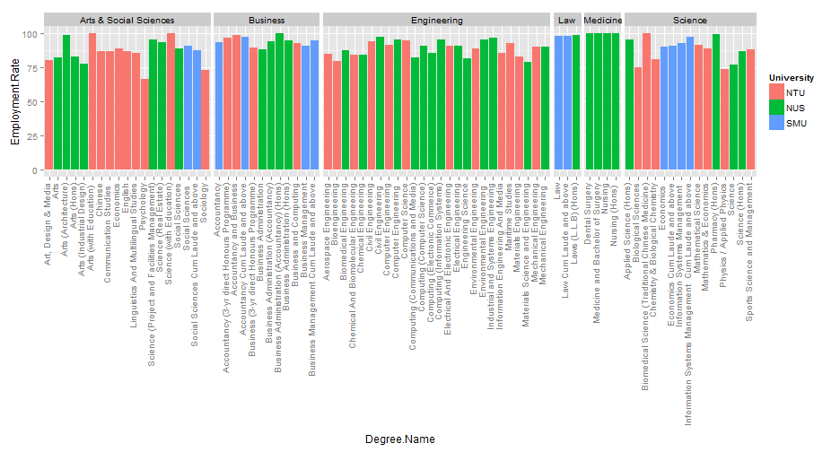

## Introduction

- The shiny application was developed in partial fulfillment of the coursework requirements for the Coursera Developing Data Products Course. 

- The app displays and and helps to visualize the results of Singapore Graduate Employment Survey (GES) 2014.

- It allows easy comparison of the employment conditions of various degrees offered by the three Singapore universities. 

- It aims to provide assistence to prospective students in making informed course decisions. 

---

## The GES Application (https://yiyangpei.shinyapps.io/GES2014)

- Users can make the following selections:
    * university
    * degree category
    * basic/gross monthly salary
    * statistics (i.e., mean/median) of the salary 

- The results (in terms of employment rate and entry salary) can be viewed by either barplot or table.

---

## An Example Plot of Employment Rate vs Degree Name for all Universities and all Degree Categories
 

---
## Data Source
The GES 2014 data reflects the employment conditions of graduates graduates as about six months after their final examinations.  
The data was retrieved from [Data.gov.sg](http://data.gov.sg/). 

- NTU http://data.gov.sg/Agency_Data/MOE/0319010000000013942F.xlsx
- NUS http://data.gov.sg/Agency_Data/MOE/0319010000000013941E.xlsx
- SMU http://data.gov.sg/Agency_Data/MOE/0319010000000013943G.xlsx
